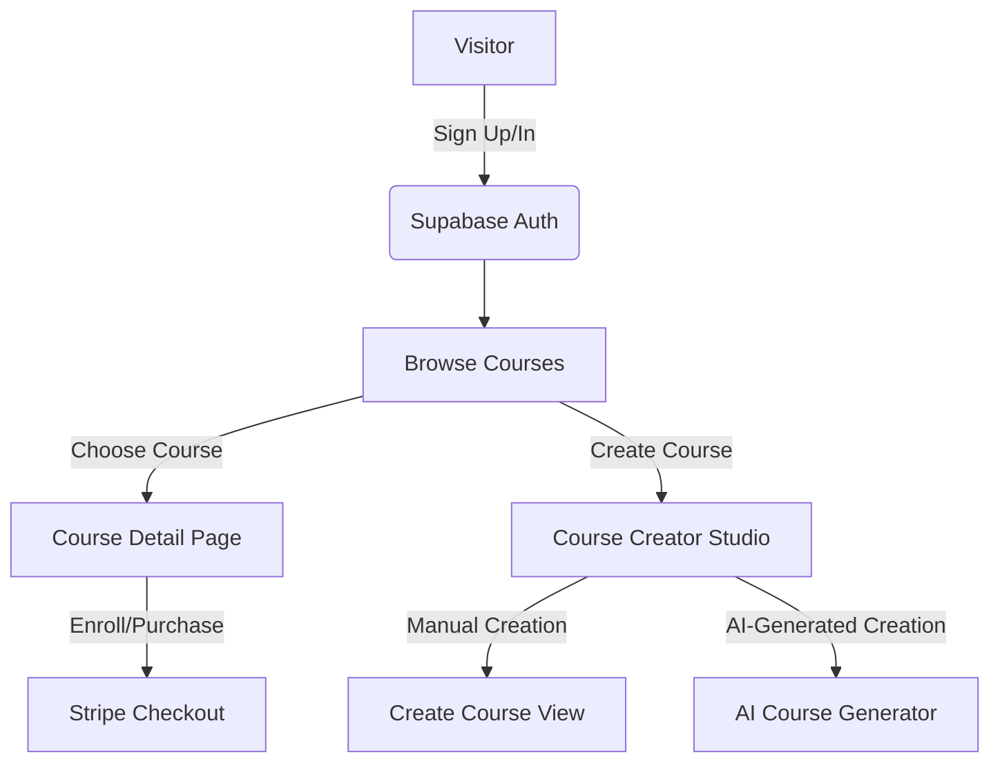
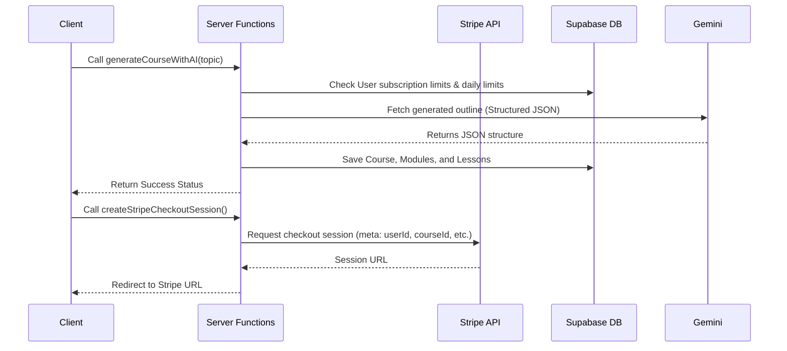
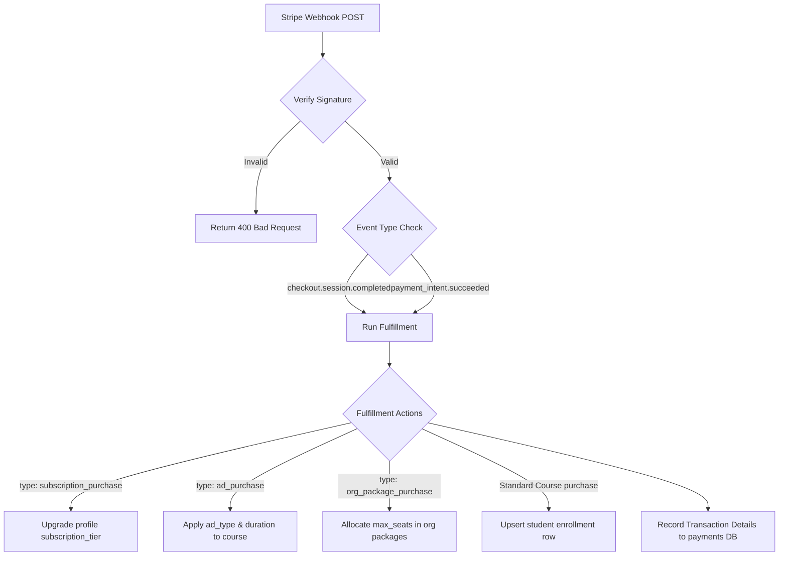

# System Flow & Architecture - AI Learn Hub

This document details the complete system flow and architectural separation between the **Frontend (Client-side)** and **Backend (Server-side & Database)** of the **AI Learn Hub** platform.

---

## System Overview

AI Learn Hub is built as a full-stack, single-repository application leveraging the following technologies:

- **Framework:** TanStack Start (combining TanStack Router and server-side execution plugins).
- **Styling:** Vanilla CSS & Tailwind v4.
- **Database & Auth:** Supabase (PostgreSQL database, Auth, and Storage).
- **AI Engine:** Google Gemini AI API (specifically `gemini-3.1-flash-lite` model for fast course structure and quiz generation).
- **Payment Gateway:** Stripe (Checkout Sessions, Promo codes, and Webhook fulfillment).

---

## 1. Frontend (Client-side Flow)

The frontend is built on **TanStack Router** using file-based routing located in `src/routes/`.



### Core User Journeys & Flows

#### A. Authentication Flow (`src/routes/login.tsx`)

1. **Login/Registration:** User inputs credentials via Supabase UI or custom OAuth providers.
2. **Session Persistence:** Auth state is stored client-side in local storage/cookies and integrated via the Supabase Client context (`src/lib/auth.tsx`).
3. **Route Protection:** Protected pages (e.g., Creator Dashboard, Billing, Admin View) check user authentication status and redirect to login if unauthenticated.

#### B. Course Browsing & Enrollment Flow (`src/routes/browse.tsx`, `src/routes/courses.$courseId.index.tsx`)

1. **Browse Courses:** Users view available courses ordered by active advertisements (Featured ads prioritized, followed by Ad value).
2. **Effective Pricing calculation (`src/lib/courses.ts`):**
   - Application dynamically checks if a **Flash Sale** is active (`saleExpiresAt > now`).
   - Checks if an **Ad Campaign** is active (offering a flat 10% discount to students).
   - Shows the final effective price.
3. **Enrollment Check:** Determines if the user already has an active enrollment (`src/lib/enrollments.ts`) to immediately bypass Stripe checkout.

#### C. AI Course Generation Flow (`src/routes/generate.tsx`)

1. **Prompt Entry:** The creator inputs a target topic, category, difficulty level, and target duration.
2. **Server Function Invocation:** Triggers the server action `generateCourseWithAI` passing parameters.
3. **Preview & Save:** The generated layout structure (modules, lessons, narration scripts, and image snapshots) is previewed. Upon confirmation, it writes directly to Supabase (`courses`, `modules`, `lessons`).
4. **Image Snapshoting:** For cover images, the system initiates a background generation, then downloads and stores the static image inside Supabase Storage so image URLs do not expire.

#### D. Learning Journey & Progress Flow (`src/routes/courses.$courseId.learn.tsx`)

1. **Interactive Course Viewer:** The student navigates through modules (`src/lib/modules.ts`) and lessons (`src/lib/lessons.ts`).
2. **Progress tracking (`src/lib/progress.ts`):** Checks off lessons as completed, writing progress percentages to the `user_progress` table.
3. **Quiz Assessment (`src/routes/courses.$courseId.lessons.$lessonId.tsx`):**
   - Renders quizzes generated by Gemini AI (`generateQuizWithAI`).
   - Checks user answers client-side, showing instant feedback, scoring, and recording attempt logs.
4. **Certificate Generation (`src/lib/certificates.ts`):**
   - Triggered upon 100% course progress.
   - Calls the AI backend `generateCertificateDescription` to write a custom mastery statement.
   - Generates a certificate record with a unique UUID hash verifiable at `/verify/$id`.

#### E. Organization & Enterprise Seat Flow (`src/routes/organization.tsx`)

1. **Organization Registration:** Users can create an organization profile and request approval for corporate packages.
2. **License Purchase:** Purchases multiple licenses/seats for target courses in bulk.
3. **Seat Management:** Organization admins invite employees by email. The system consumes a seat license and auto-enrolls the worker.

#### F. Advertising & Spotlight Flow (`src/routes/pricing.tsx`, `src/routes/admin.index.tsx`)

1. **Purchase Ads:** Creators pay to feature their courses (Spotlight, Banner, Sidebar).
2. **Campaign Config:** Boosts course visibility with ad bids, directly impacting sorting order on the Browse Page.

---

## 2. Backend (Server-side Flow)

The backend runs inside **TanStack Start**'s server context (deployable to Cloudflare Workers or server environments via Nitro engine).



### Core Backend Processes & Modules

#### A. Server Functions (`src/lib/ai.ts`, `src/lib/stripe.ts`)

TanStack Start uses type-safe server functions (`createServerFn`) that execute strictly on the server node. These handle tasks requiring privileged secrets or database service-role operations:

1. **Course Outline Generator (`generateCourseWithAI`):**
   - Validates developer Gemini API Keys.
   - Enforces monthly subscription creation quotas (e.g. Free gets 2 generations, Starter gets 10, Growth gets 30).
   - Validates prompt structures, calls the Gemini API endpoint, parses the returned JSON, and enforces schema conformance using **Zod**.
2. **Quiz Outline Generator (`generateQuizWithAI`):**
   - Calls Gemini to construct multiple-choice or true-false questions based on the course topic.
3. **Checkout Session Creation (`createStripeCheckoutSession`):**
   - Computes effective payment prices securely on the server.
   - Generates a Stripe Checkout Session, appending critical metadata (e.g., `userId`, `courseId`, `couponId`, `orgId`, purchase `type`).

#### B. Plagiarism Check Engine (`src/lib/plagiarism.ts`)

Executes a backend Levenshtein-distance algorithm to calculate string similarities between a newly created course (title/description) and existing courses in the database:

- Returns similarity percentages.
- Helps moderators prevent duplicate AI course generation spam.

#### C. Stripe Webhook Processing Flow (`src/server-runtime/webhook.ts`)

Stripe triggers asynchronous HTTP POST calls to `/api/stripe-webhook` or `/api/stripe/webhook` when actions succeed.



1. **Signature Verification:** Reconstructs the webhook payload securely using the local Stripe Webhook Secret (`constructEventAsync`) to prevent spoofing.
2. **Fulfillment Processor (`runFulfillment`):**
   - Extracts metadata identifiers (`userId`, `courseId`, `orgId`, etc.).
   - Initiates database writes using a privileged Supabase client (`getAdminDb()`) that bypasses Row-Level Security (RLS).
   - Performs specific database actions based on purchase type:
     - **Subscriptions:** Updates `profiles.subscription_tier` and sets an expiry date.
     - **Ad Purchases:** Applies `ad_type`, `ad_expires_at` and `ad_amount_paid` to target courses, inserting a record into `ad_purchases`.
     - **Organization seat licenses:** Inserts or increments `organization_packages` seats.
     - **Standard Enrollment:** Inserts an enrollment row linking `user_id` and `course_id`, then triggers coupon usage updates if applicable.
3. **Transaction logger (`recordPayment`):**
   - Details of the payment (amounts, transaction IDs, statuses) are written to the database to ensure auditing trail integrity.

---

## 3. Database Architecture (Supabase Schema Map)

The schema defines the boundary between user-accessible tables (protected via RLS and JWT tokens) and system tables modified via server webhooks/functions.

```
                  ┌─────────────────┐
                  │    profiles     │
                  └────────┬────────┘
                           │ 1
                           │
                           │ 1..*
                  ┌────────┴────────┐
                  │     courses     │◀─────────┐
                  └────────┬────────┘          │
                           │ 1                 │
                           │                   │
                           │ 1..*              │
                  ┌────────┴────────┐          │
                  │     modules     │          │ 1..*
                  └────────┬────────┘          │
                           │ 1                 │
                           │                   │
                           │ 1..*              │ 1
                  ┌────────┴────────┐ 1..*     │
      ┌──────────▶│     lessons     │──────────┼──────────┐
      │           └─────────────────┘          │          │
      │ 1                                      │          │
      │                                        │          │
      │ 1..*                                   │          │ 1..*
┌─────┴───────────┐                  ┌─────────┴──────┐ ┌─┴───────────────┐
│  user_progress  │                  │  enrollments   │ │     quizzes     │
└─────────────────┘                  └────────────────┘ └─────────────────┘
```

### Table Roles:

- **`profiles`**: Stores subscription tiers, details, user roles, and AI course generation quotas.
- **`courses` / `modules` / `lessons`**: Core content catalog structure.
- **`enrollments`**: Acts as a join table linking students to courses they have purchased or enrolled in.
- **`user_progress`**: Tracks which student has completed which lesson.
- **`quizzes`**: Links assessments to lessons/modules.
- **`organization_profiles` / `organization_packages` / `organization_members`**: Manages B2B organizations, seats, and member assignments.
- **`ai_logs`**: Back-end system audit trail logging daily generation counts for rate limiting.
- **`payments` / `ad_purchases`**: Webhook-updated ledger recording course buys and ad sponsorships.

---

## 4. Recommended Future & New Features

To scale the AI Learn Hub platform and enhance engagement, the following feature additions are recommended:

### A. Botnoi Video & Voiceover Synthesis (TTS)

- **Goal:** Turn generated text scripts into dynamic, localized audio narration or talking-avatar videos.
- **Flow Details:**
  1. During course generation, extract the lesson script from the Gemini output.
  2. Send a backend request to the Botnoi API payload (`generateVideoWithBotnoi` placeholder) with the target script text.
  3. Save the resulting MP3 audio or MP4 video file to a Supabase storage bucket.
  4. Render this media automatically in the Lesson Player for the student.

### B. Interactive AI Learning Assistant (In-Course Chatbot)

- **Goal:** Provide students with context-aware, immediate answers to questions on lesson materials.
- **Flow Details:**
  1. Embed an AI chat interface inside [courses.$courseId.learn.tsx](file:///C:/Users/ASUS/ai-learn-hub-22/src/routes/courses.$courseId.learn.tsx).
  2. When a student posts a question, send the current lesson content, module descriptions, and student prompt to Gemini.
  3. Stream answers directly to the student without page reloads.

### C. Advanced Plagiarism & Quality Control Checker

- **Goal:** Prevent AI content replication and low-quality generation spam.
- **Flow Details:**
  1. Extend [plagiarism.ts](file:///C:/Users/ASUS/ai-learn-hub-22/src/lib/plagiarism.ts) to evaluate full lesson text descriptions and scripts.
  2. Block publication of new courses if similarity checks exceed a defined threshold (e.g., > 60% similarity).
  3. Include an automated quality assessment check that rates readability and instructional alignment.

### D. Verified Certificate Verification & PDF Downloads

- **Goal:** Enhance the credibility and shareability of course accomplishments.
- **Flow Details:**
  1. Render a high-quality Canvas or SVG certificate template.
  2. Provide a "Download PDF" server-side function.
  3. Allow students to add their certificates to LinkedIn directly via verification hash routes (`/verify/$id`).

### E. Enterprise Analytics Dashboard

- **Goal:** Provide B2B client organizations with visibility into employee progress.
- **Flow Details:**
  1. Aggregate completion rates, average quiz scores, and course popularity within [organization.tsx](file:///C:/Users/ASUS/ai-learn-hub-22/src/routes/organization.tsx).
  2. Support exporting reports as CSV/Excel for HR and training managers.
